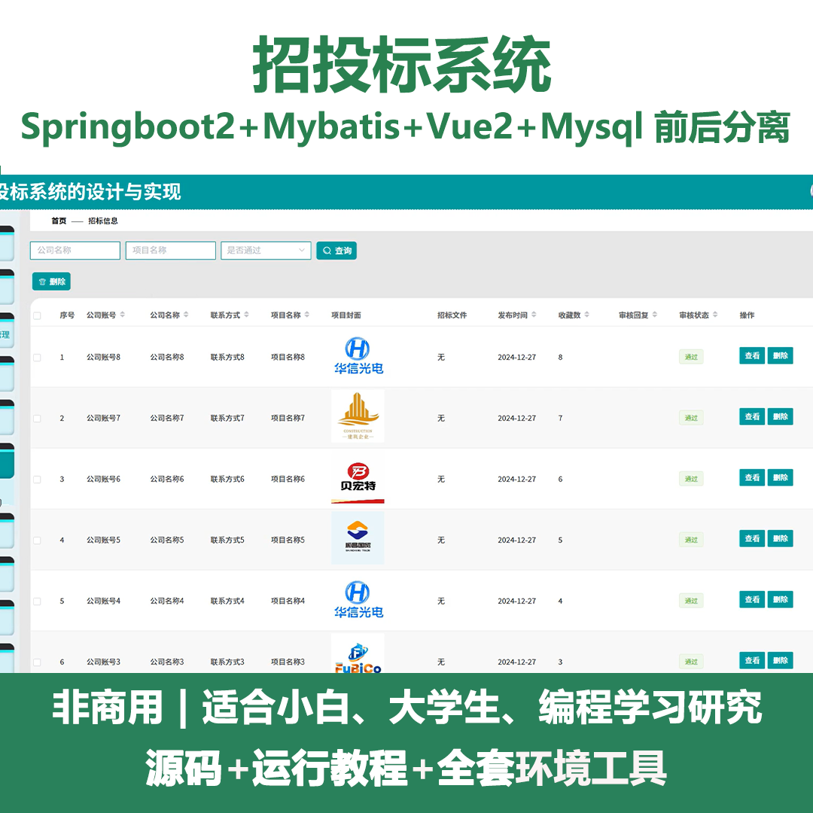
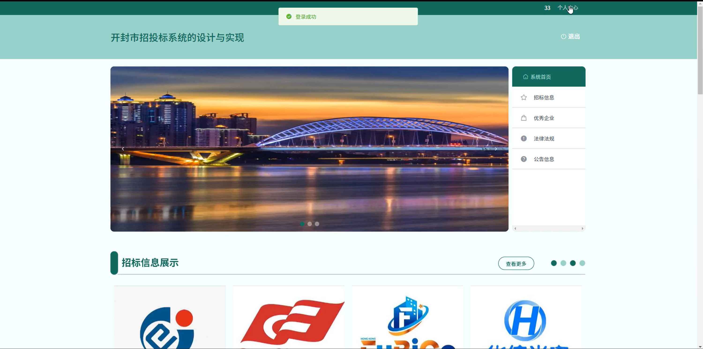
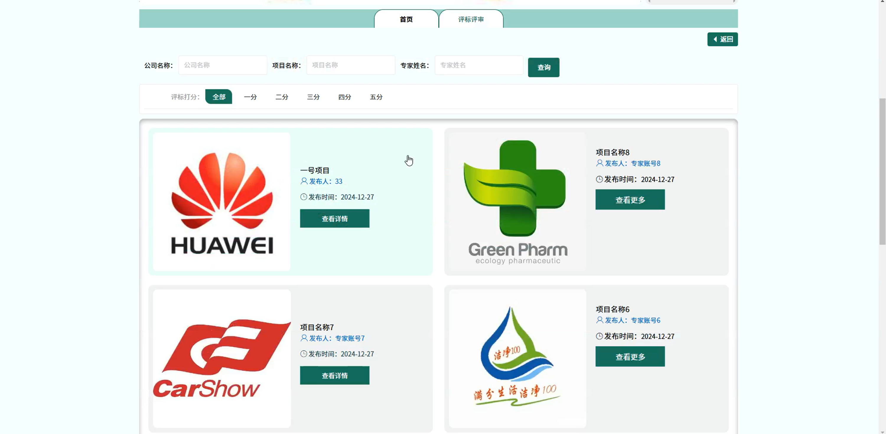
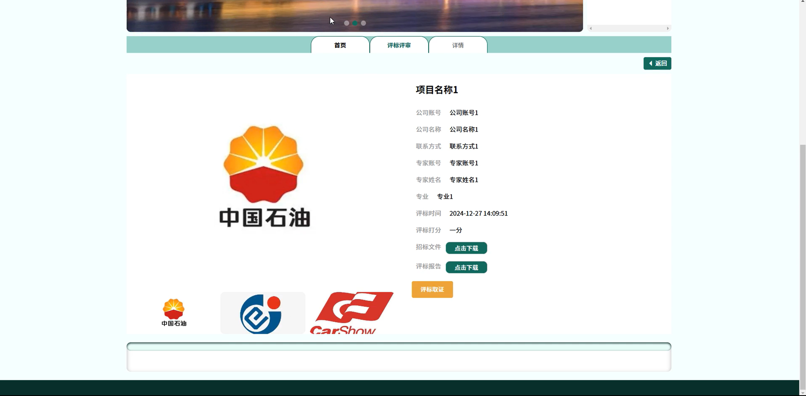
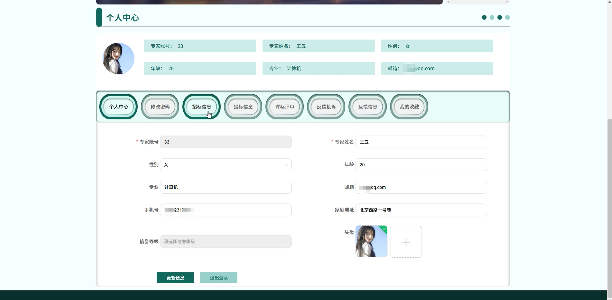
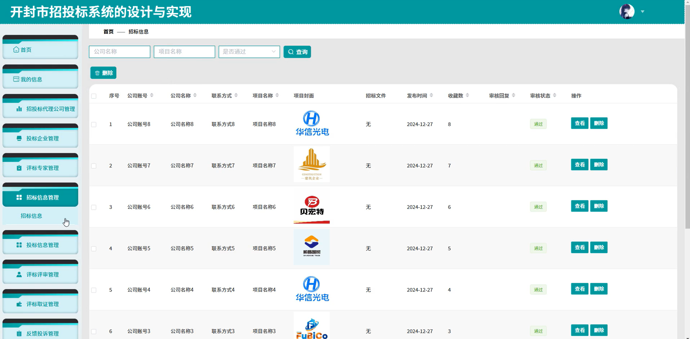
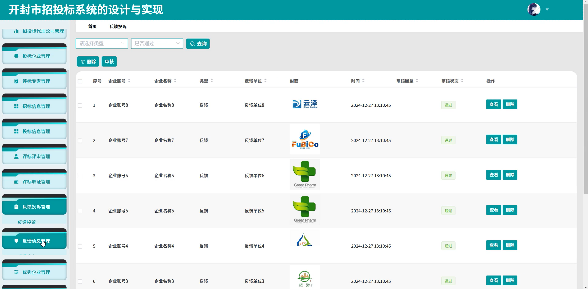
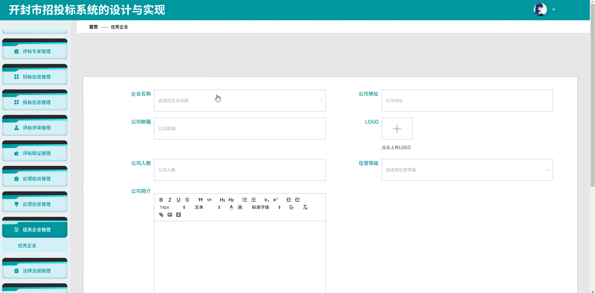
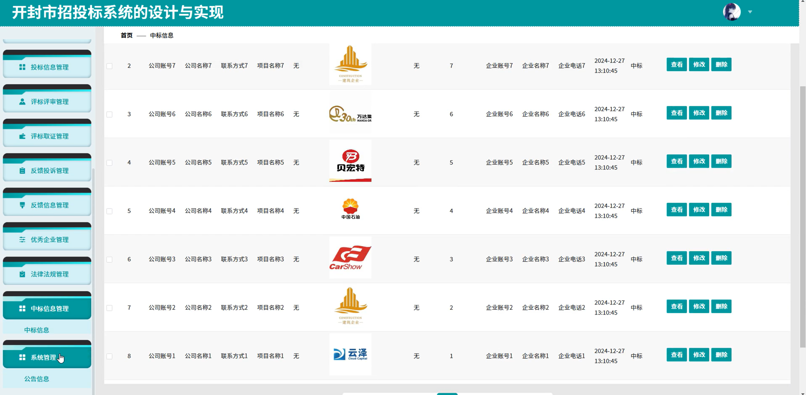

# springbootA451D
springbootA451D招投标系统
 
## 查看主页获取源码

### 一、关键词
投标企业管理、评标专家管理、标信息管理

### 二、作品包含
源码+数据库+全套环境和工具资源+本地部署教程

### 三、项目技术
前端技术：Html、Css、Js、Vue2.0、Element-ui 
后端技术：Java、SpringBoot2.0、MyBatis

### 四、运行环境（以下版本亲测，其他版本未知，请自测）
开发工具：IDEA/eclipse  + VSCODE

数据库：MySQL5.7（最低要5.7版本）

数据库管理工具：Navicat10以上版本

环境配置软件： JDK1.8 + Maven3.6.3

前端Nodejs：14

浏览器：谷歌浏览器

### 五、项目介绍
项目编号：springbootA451D

招投标系统是用于规范和高效管理招投标全流程，实现招投标活动透明化、流程化与信息化的工具平台。

角色：管理员、招投标代理公司、投标企业、评标专家

管理员：首页、我的信息、招投标代理公司管理、投标企业管理、评标专家管理、招标信息管理、投标信息管理、评标评审管理、评标取证管理、反馈投诉管理、反馈信息管理、优秀企业管理、法律法规管理、中标信息管理、系统管理。

招投标代理公司：系统首页、招标信息、优秀企业、法律法规、公告信息、个人中心、修改密码、招标信息、投标信息、评标评审、评标取证、反馈投诉、反馈信息、我的收藏。

投标企业：系统首页、招标信息、优秀企业、法律法规、公告信息、个人中心、修改密码、招标信息、投标信息、评标评审、评标取证、反馈投诉、反馈信息、我的收藏。

评标专家：系统首页、招标信息、优秀企业、法律法规、公告信息、个人中心、修改密码、招标信息、投标信息、评标评审、评标取证、反馈投诉、反馈信息、我的收藏。

### 六、运行截图

